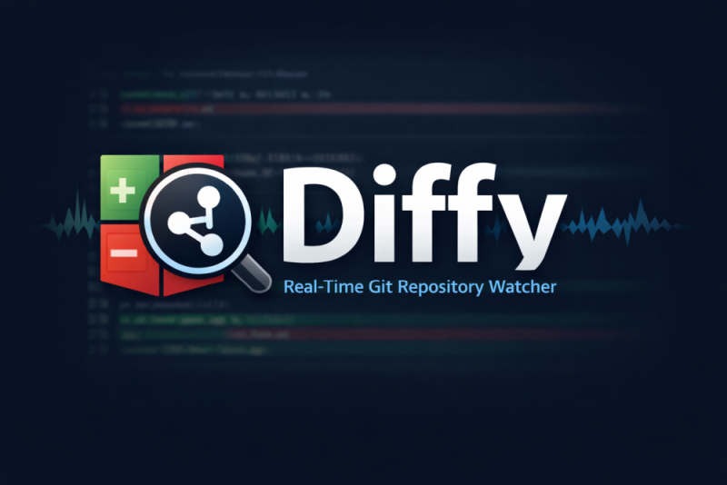
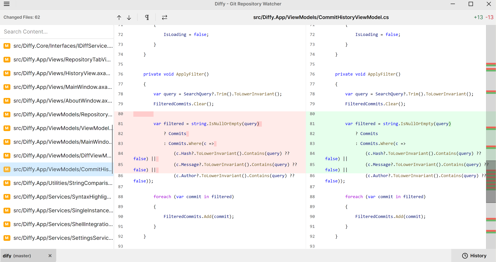

# Diffy

<p align="center">
  <strong>Git repository watcher with realtime diffs</strong>
</p>

<p align="center">
  
</p>

<p align="center">
  <a href="https://github.com/sarfraznawaz2005/diffy/releases/latest">
    
  </a>
  <a href="https://github.com/sarfraznawaz2005/diffy/actions/workflows/ci.yml">
    
  </a>
  <a href="LICENSE">
    
  </a>
</p>

## Features

### Core Functionality
- **Multi-Repository Management**: Open and watch multiple Git repositories simultaneously in tabs
- **Real-Time Watching**: Instant UI updates when files change via native file system watching
- **Dual Diff Modes**: Switch between side-by-side and inline diff views
- **Syntax Highlighting**: Code-aware syntax highlighting for over 100 languages using TextMate grammars
- **Diff Minimap**: Bird's-eye view overlay showing all changes at a glance

### Git Integration
- **Commit History Browser**: Paginated history view (50 commits per page)
- **Commit File Viewing**: See exactly what files changed in any commit
- **Branch Display**: Shows current branch in tab headers
- **Safe Repository Handling**: One-click fix for Git `safe.directory` configuration issues

### Search & Navigation
- **Content Search**: Search file paths and file content (including diffs)
- **History Search**: Find commits by hash, message, or author
- **Jump to Change**: Quickly navigate between diff changes (F7 / Shift+F7)

### User Experience
- **Theme Support**: Light, Dark, and System themes with full resource dictionaries
- **Whitespace Toggle**: Option to ignore whitespace in diffs
- **Recent Repositories**: Quick access to your last 10 opened repositories
- **Context Menu Integration**: "Watch with Diffy" option in Windows Explorer
- **Single Instance**: Prevents multiple app instances

## Screenshot

### Main Interface


## Installation

### Download Releases

Get the latest release for your platform from the [Releases page](https://github.com/sarfraznawaz2005/diffy/releases/latest):

| Platform | Architecture | Download |
|----------|-------------|----------|
| Windows | x64 | `diffy-win-x64.zip` |
| Windows | ARM64 | `diffy-win-arm64.zip` |
| macOS | Intel (x64) | `diffy-osx-x64.zip` |
| macOS | Apple Silicon (arm64) | `diffy-osx-arm64.zip` |
| Linux | x64 | `diffy-linux-x64.zip` |
| Linux | ARM64 | `diffy-linux-arm64.zip` |

### Build from Source

#### Prerequisites
- .NET 8.0 SDK
- Git

#### Steps

```bash
# Clone the repository
git clone https://github.com/sarfraznawaz2005/diffy.git
cd diffy

# Build the solution
dotnet build Diffy.sln

# Run the application
dotnet run --project src/Diffy.App/Diffy.App.csproj

# Run tests
dotnet test
```

## Usage

### Opening Repositories

1. **From Menu**: Click the menu icon (≡) → "Open Repository" or press `Ctrl+O`
2. **From Context Menu**: Right-click any folder and select "Watch with Diffy"
3. **From Recent**: Access previously opened repositories from the menu

### Keyboard Shortcuts

| Shortcut | Action |
|----------|--------|
| `Ctrl+O` | Open repository |
| `F5` | Refresh current tab |
| `F7` | Jump to next change |
| `Shift+F7` | Jump to previous change |
| `Alt+F4` | Exit application |

### File Operations

- **Open File**: Double-click or press Enter to open in default editor
- **Revert**: Revert file to HEAD commit
- **Delete**: Move file to system trash/recycle bin
- **View Diff**: Click any file to see its diff
- **Search**: Use the search box to filter files or search content

## Architecture

### Tech Stack
- **Framework**: .NET 8 (C# 12)
- **UI**: Avalonia UI 11.3.11 (MVVM pattern)
- **Reactivity**: ReactiveUI 11.3.8
- **Git**: LibGit2Sharp 0.31.0
- **Diffing**: DiffPlex 1.9.0
- **Syntax Highlighting**: AvaloniaEdit.TextMate with TextMateSharp
- **DI**: Microsoft.Extensions.DependencyInjection 10.0.2

### Project Structure

```
Diffy/
├── src/
│   ├── Diffy.App/          # Main application (Avalonia UI)
│   └── Diffy.Core/         # Shared models & interfaces
└── tests/
    └── Diffy.Tests.Unit/   # Unit tests
```

## Contributing

We welcome contributions! Please see [CONTRIBUTING.md](CONTRIBUTING.md) for details.

### Development Setup

```bash
# Clone and navigate
git clone https://github.com/sarfraznawaz2005/diffy.git
cd diffy

# Restore dependencies
dotnet restore

# Build
dotnet build

# Run tests (watch mode)
dotnet watch test --project tests/Diffy.Tests.Unit
```

### Code Style

- Follow existing code conventions
- Use `dotnet format` before committing
- Ensure all tests pass
- No build warnings allowed

## Testing

The project has comprehensive unit test coverage (~85%):

```bash
# Run all tests
dotnet test

# Run with coverage
dotnet test --collect:"XPlat Code Coverage"

# Run specific test
dotnet test --filter "FullyQualifiedName~DiffServiceTests"
```

## Known Issues

Only tested on Windows 11.

## License

This project is licensed under the MIT License - see the [LICENSE](LICENSE) file for details.

## Acknowledgments

- [Avalonia UI](https://avaloniaui.net/) - Cross-platform UI framework
- [LibGit2Sharp](https://github.com/libgit2/LibGit2Sharp) - Git bindings for .NET
- [DiffPlex](https://github.com/mmanela/diffplex) - Diff generation library
- [TextMateSharp](https://github.com/dreadwall/TextMateSharp) - TextMate grammar support
- [ReactiveUI](https://reactiveui.net/) - MVVM and reactive extensions

## CLI Alternative

[DiffWatch](https://github.com/sarfraznawaz2005/diffwatch)
